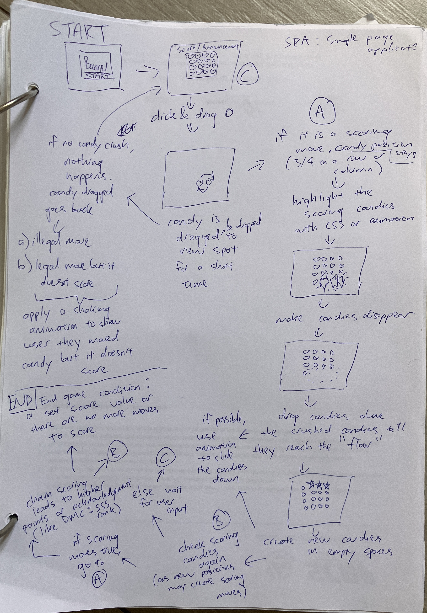
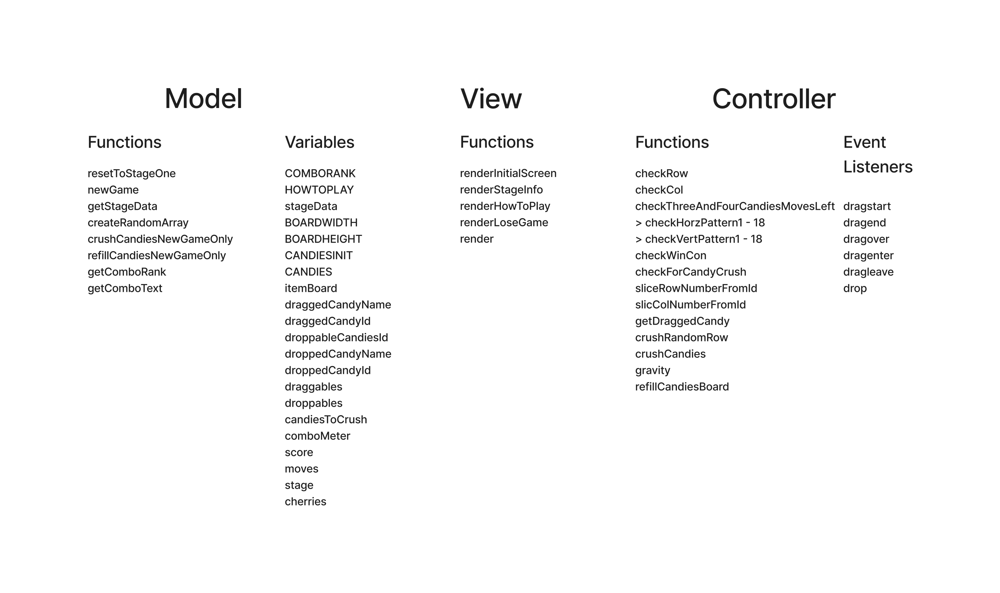
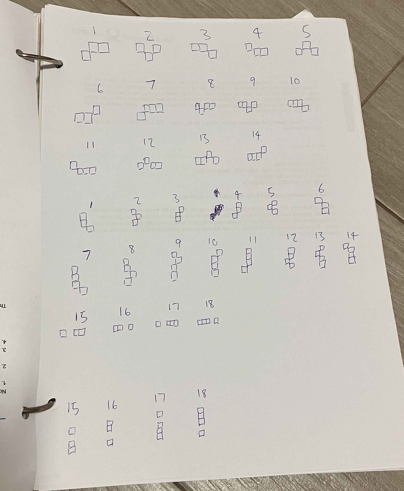

# Building Candy Crush

This is my first project for General Assembly's Software Engineering Immersive Flex program.

## Technologies & Tools Used

- HTML
- CSS
- JavaScript
- JQuery
- Git & GitHub

## Description

Candy Crush Saga is a puzzle game that involves making matches of 3 or more colored candy pieces. Released by King in 2012, it is played by millions around the world.
Players swap candy pieces either horizontally and vertically, and once a match is made, the candy disappears, 
causing the surrounding pieces of candy to fall into the empty spaces. 

## Deployment

https://candycrushgame-alpha.vercel.app/

## How To Play

Players drag a candy to swap its position. A candy can only be swapped if it leads to a match of 3 or more.
The candy can only be swapped with those that are adjacent to it. At the top, bottom, left and right.
If the player runs out of candies to swap, the game is over.

I have added my own spin to the game by creating a Sugar Crush Mode if the player crushes 
30 candies in a row continuously. The game will then randomly crush 1 row of candies, which builds up momentum leading to a feedback loop of more candies getting crushed leading to more possible matches and in turn more crushes. This idea was taken from the style rank mechanic of Devil May Cry games.

Sugar Crush Mode is needed to complete the 2nd and 3rd stage of the game.

## Wireframe

<!--  -->

*Figure 1: Wireframe*

The sequence of the game is:
1. creating the board of candies
2. drag and drop function for candies
3. checking whether if a candy can be dragged then dropped at its new position
4. checking the board if there is a match of 3 or more candies, then highlight the matching candies
5. those candies are then removed
6. there has to be a visual cue that the candies are dropping to the floor
7. the empty spaces left behind are then refilled with new candies
8. the new candies may create matches, so the game loops back to point 4
9. if there are no matches, the game waits for the next player move
10. the game ends if there are no more possible matches to be made or the objective like a certain numerical score is met

## Game Architecture

The architecture used is MVC - Model View Controller.

*Figure 2: MVC*

### Model

The model consists of the information for each stage like objectives, types of candies available, game mechanics and most importantly the game board made up of the candies. 

The game board is updated based on the actions of the player and game mechanics before being rendered.

### View

Document Object Model using Javascript and JQuery is used for rendering.

### Controller

Functions to apply points 3 to 10 mentioned in the wireframe.
Drag and drop event listeners.

## Approach to Development

- Take incremental steps and apply the simplest possible solution every step of the way.

- If I change any code, comment it out and add the new code below it for reference.

- Frequent console logs to check whether the outputs of all the functions are working as intended.

- If making drastic changes to the code, I will create a new branch out from the master branch to avoid breaking down the entire game.

## Key Learnings

- Learning how to read the documentation to implement the drag and drop functions like dragstart, dragover and drop.

- Applying creativity to my knowledge of array manipulation to write the functions that manipulate the model.
- Viewing things from the player's perspective, like how to present the candies remaining are sliding down and not randomly generated. 

Functions are written to be presented frame by frame, something like a cartoon animation.
- Checking for errors when the code doesn't run as intended and there are no errors in the console. When some candies cannot be dragged and dropped even though they should, I had to comment out parts of the code and pinpoint which code is the cause of the problem.

## How the Game Runs

### Starting the Game

`renderInitialScreen` is the first thing the player sees. The 'PLAY' button will trigger `renderStageInfo`. The variable `stage` is applied to `getStageData` which will access the array `stageData` which contains the information in JSON needed to render each stage. 

The info includes name, description, size of the candy board, types of candies the game starts with, subsequent types of candies that 'respawn' and the win condition which is a function. 

Having the win condition as a function offers flexibility to deciding how the game ends. `stageData` is at the top of the script file, so it can be amended easily. The game conditions are not hard coded in, so only changing `stageData` is needed. Unless new mechanics like striped and jelly candy are added.

### Creating the Model Array

An array called `itemBoard` represents the game. Row and column numbers start from zero so that `itemBoard` is easy to manipulate. The candy in the top left corner is in row 0 column 0. If it is the red jellybean, it is candy1 in string format. Then `itemBoard[0][0] = "candy1"`. 

`createRandomArray` may lead to 3 or more matching candies appearing when the game starts. To fix this, the model is checked for matching candies 5 times. If there is a match, the matching candies are crushed, new candies added then checked again.

### Rendering the View

`render` uses for loops to iterate through `itemBoard` and then create an image file based on the candy name. Every candy has its own id based on its row and column number. For the candy at `itemBoard[0][0]`, the id of the image rendered will similiarly be `row0col0`.

There are also conditionals to assign additional properties to the image, such as `class="droppable"`.

### Implementing Drag and Drop

A candy can be dragged only if it is dropped onto an adjacent candy and the drop leads to a matching combination. 

The event listener `dragstart` will detect the id of the candy being dragged. The position of the candy is stored in `draggedCandyId`. From the id, the adjacent candies can be found. The class `adjacent` is applied to these candies.

But now candies can be drag and drop even if there is no matching combination. To fix that, before the player can drag a candy, the function `checkThreeAndFourCandiesMovesLeft()` iterates through the whole board to detect all potential scoring combinations. This function also helps to detect whether the player has run out of `moves` so the game can end.

*Figure 3: Scorable Combinations*

A scoring pattern detected will input the positions of the candy that can be dragged into the array `draggables` and the candy that can be dropped onto into the array `droppables`. But some players will play the game in reverse, dragging away the candy in the drop position towards the candy in the drag position.

So if only the candies in `draggables` can be dragged, players who do the reverse will get stuck as they want to drag the candies in `droppables`. 

To work around this, all candies are draggable. When a candy is dragged, `getDraggedCandy()` iterates through `draggables` and `droppables` for a match. If there is a match, the corresponding candy in the other array (same index number) is given the class `dropzone`. 

The event listeners `dragover`, `dragenter`, `dragleave` and `drop` can only work if a candy has both classes `dropzone` and `adjacent`. If a candy is dropped successfully, `checkForCandyCrush()` will trigger.

### Checking and Crushing Candy

Inside `checkForCandyCrush()`:

`itemBoard` is mapped the same way into `checkingArray` which updates what the candies the player has moved. 

`checkRow()` and `checkCol()` will scan `checkingArray` for matches. If there are matches, these candies will have their positions pushed into the array `candiesToCrush`. 

If this array is not empty, `itemBoard` is updated and `crushCandies()` will be triggered. 

CSS will also be updated to these candies to show the player which candies will be crushed. 

Also, all the variables storing the dragged and dropped candies are cleared.

`crushCandies()` will update `itemBoard` by replacing the candies with a plain image file of the background color of the game board. 

`score` and game mechanic `comboMeter` are updated.

### Creating the Visual Feel of Candies Falling

I use `setTimeout` on the functions `checkForCandyCrush()` and `crushCandies()`, so the player will see the candies getting crushed and disappearing. 

Then the candies above are suspended in midair for a brief moment before being pulled by `gravity()`. 

`gravity()` filters out the empty spaces in `itemBoard` then unshifts in new empty spaces to push the remaining candies to the 'ground'. Transposing `itemBoard` makes it easier to do this.

### Refilling the Empty Spaces

Empty spaces in `itemBoard` are converted to random candies.

Now `checkThreeAndFourCandiesMovesLeft()` check whether the player is still in the game. 

`checkWinCon()` will end the game and move the player to the next stage if the objective is met. 

If not, `checkForCandyCrush()` will run again as the new positions of the candies can have matches. 

If there are matches, the whole cycle repeats. If not, the game will wait for the player's next move.

### Testing New Stages

`resetToStageOne` at line 86 will let the creator skip stages without having to change multiple lines of code. 
Change `stage = 1` to the desired stage number.

## Future Developments / Improvements

- Make the code more DRY
- Reduce global variables
- Add animations using jQueryUI
- New game mechanics like striped, wrapped and jelly candies

### References

- Using img instead of div for candies & manipulating the candy id to find the adjacent candies:
https://youtu.be/8yIKZQMGi0A

#### Game Asset Atrributions

- Candy images: http://www.seungsung.com/candy-crush-friends-launch-campaign
- Cherry image: https://pin.it/2oFSxnt
- Background image: https://www.freepik.com/free-photos-vectors/cartoon-candy-land/4
